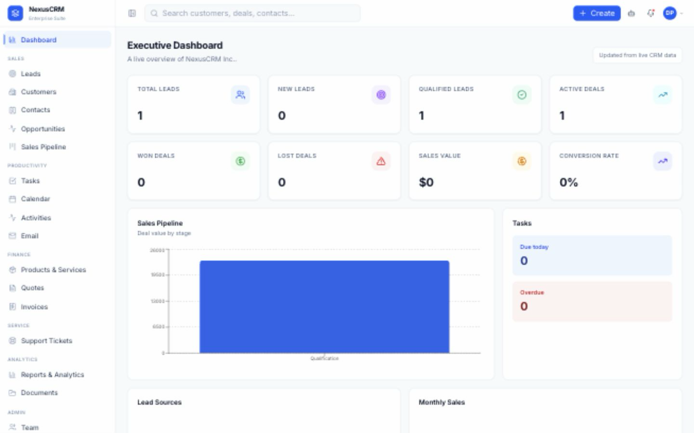
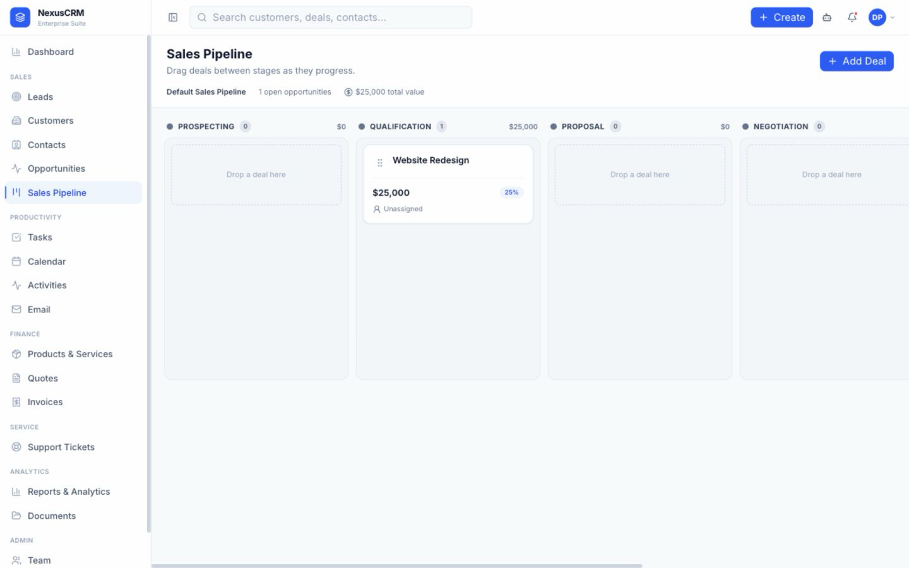

# AI Powered CRM & Sales Pipeline

NexusCRM is a responsive, multi-organization CRM for SMB sales and support teams. It uses Laravel 12, Sanctum, MySQL, React 19, TypeScript, Vite, and Tailwind CSS. AI is optional, disabled by default, and includes a safe mock mode.

## Screenshots





## Features

- Session authentication, password reset, profiles, invitations, six organization-scoped roles, and account activation
- Real dashboard metrics, leads, customers, contacts, opportunities, keyboard-accessible Kanban pipeline, calendar/tasks, catalog, quotations, invoices, support tickets, documents, reporting, notifications, and settings
- Global search, reusable record timelines, notes, tags and private attachments, ticket conversations, CSV contact import/export, branded quote/invoice PDFs, and queued outbound email
- Administrator-managed workflow catalogs, notification preferences, SMTP settings, roles, and granular permissions
- Server-side validation, tenant scopes, policies/permissions, rate limiting, soft deletion, activity and stage history, encrypted AI credentials, and AI usage logs
- Responsive desktop/tablet/mobile shell based on the supplied Figma Make design
- PHPUnit feature tests, Vitest/RTL, ESLint, Prettier, Laravel Pint, Docker, and GitHub Actions

## Local setup with XAMPP MySQL

Requirements: PHP 8.3+, Composer 2, Node 22+, pnpm 10, and XAMPP MySQL/MariaDB running on port 3306.

```bash
mysql -u root -e "CREATE DATABASE IF NOT EXISTS ai_powered_crm CHARACTER SET utf8mb4 COLLATE utf8mb4_unicode_ci;"
cd backend
cp .env.example .env
composer install
php artisan key:generate
php artisan migrate --seed
php artisan serve
```

In another backend terminal, run the queue worker for invitations, reminders, and outbound email:

```bash
cd backend
php artisan queue:work --tries=3
```

In a second terminal:

```bash
cd frontend
cp .env.example .env
pnpm install
pnpm dev
```

Open `http://localhost:5173`. Demo login: `admin@nexuscrm.test` / `Password123!`. Change this password outside local demonstrations.

The system PHP CLI should be used because older XAMPP PHP bundles may not satisfy Laravel 12's PHP requirement. XAMPP can continue providing MySQL.

## Docker

```bash
cp backend/.env.docker.example backend/.env.docker
cd backend && php artisan key:generate --show
# Put the generated value in backend/.env.docker as APP_KEY, then return to the project root.
cd ..
docker compose up --build
```

The frontend is at `http://localhost:5173`, API at `http://localhost:8000`, and container MySQL is exposed at port 3307 to avoid conflicting with XAMPP. Replace all example Docker credentials and generate a real `APP_KEY` for non-local environments.

## Tests and quality

```bash
cd backend && php artisan test && ./vendor/bin/pint --test
cd frontend && pnpm typecheck && pnpm lint && pnpm test && pnpm build
```

## Architecture

- `backend/app/Http`: versioned REST controllers, Form Requests, Resources, and middleware
- `backend/app/Services`: transactional business operations, dashboard queries, tenancy, pipeline, and reusable module services
- `backend/app/Models`: organization-scoped Eloquent domain models
- `frontend/src/app`: session/authentication state and protected routing
- `frontend/src/components`: accessible UI and responsive application shell
- `frontend/src/pages`: lazy-loaded feature pages
- `frontend/src/lib`: configured API client and shared utilities

See [API documentation](docs/API.md), [database ERD](docs/ERD.md), and [contribution guide](CONTRIBUTING.md).

See the [production operations runbook](docs/OPERATIONS.md) for backups, logging, storage security, health checks, and release procedures.

## AI integration

AI is disabled by default. An administrator with `ai.configure` can select an OpenAI-compatible base URL/provider/model, set a daily limit, and provide an API key. Keys are encrypted with Laravel's application key and never returned. The assistant supports follow-up drafts, history and meeting summaries, next-action suggestions, proposal text, lead priority, and sentiment. The provider adapter uses the compatible chat-completions contract with authenticated requests, bounded timeouts/retries, safe errors, and request logs. Mock mode is intended for local demonstrations and tests. Core CRM requests never depend on AI availability.

## Deployment

Use HTTPS, a production `APP_KEY`, managed MySQL/PostgreSQL, secure secrets injection, `APP_DEBUG=false`, a process manager for queue workers, scheduled `php artisan schedule:run`, persistent private file storage, backups, and a reverse proxy. Run migrations during a controlled release and execute both test suites before promotion.

## Security and limitations

Tenant context is required on organization APIs through `X-Organization`; membership and permissions are validated server-side. Uploaded attachments use private storage with type/size/checksum validation. SMTP and AI credentials are encrypted and masked from API output. For production, add infrastructure-level malware scanning, a durable object store, verified email DNS, centralized logs, and managed secrets. Local email defaults to Laravel's log mailer until SMTP is configured.

## Future enhancements

Two-way provider-specific inbox/calendar synchronization, online payments, e-signatures, malware scanning, richer forecasting, and native mobile clients.
