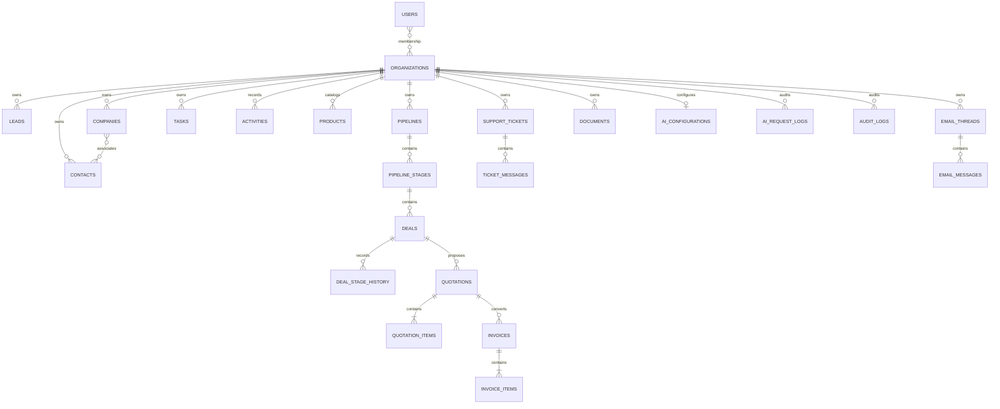

# Database ERD

Every business table is indexed by organization and its common filter/sort columns. Public ULIDs prevent exposing sequential internal IDs. Foreign keys enforce integrity; recoverable entities use soft deletion.
